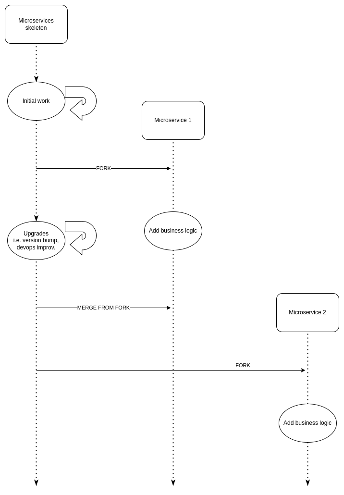

# Skeleton for microservices Django+DRF+Docker+Postgres

## Table of Contents
1. [About](#about)
2. [How to run on local machine](#how-to-run-on-local-machine)
    - [Flake8](#flake8-static-code-analyzer)
    - [Git Hooks](#git-hooks)
    - [Unit Tests](#unit-testing)
3. [How to run on dev containers](#how-to-run-on-development-containers)
4. [How to run on prod containers](#how-to-run-on-production-containers)
5. [Online API documentation tool](#online-api-documentation-tool)
6. [Secret Manager](#secret-manager)
7. [TODOs](#todos)


## About

This project contains a production ready, minimal and generic Django skeleton to be used as base for new microservices in a microservices architecture. See image with proposed workflow: 



This project can work:

- Locally directly in your dev machine
- Using docker and containers in your development machine
- On staging and production environments using containers and the production configuration

The most important technologies that this project uses are:

- Django
- Django Rest Framework
- Docker: with different Dockerfile and docker-compose.yml files for dev and prod
- Flake8: static code analyzer
- Gunicorn: application server (for production)
- Nginx: reverse proxy for Gunicorn to handle client requests as well as serve up static files (for production)

The use of this skeleton as base when spining new microservices brings great advantages to the application development cycle, check out the below workflow that illustrates it:

- Do the (configuration, devops, upgrades, etc) work just once, then profit from it.
- Have a common company-wide approach in terms of architecture, logging, used tools...
- Avoiding constants designs from scratch, and rather focusing on the business logic of new applications.
- Reduce the need of devops/architecture knowledge of engineers spinning new services.


## How to run on local machine

```
git clone 
cd django-microservice-skeleton/app
python3 -m venv env
source env/bin/activate
pip install -r requirements.txt
python manage.py migrate
python manage.py runserver
```

Try [http://localhost:8000/ping](http://localhost:8000/ping)

### Unit testing

We want to make a especial effort in having adequate unit testing coverage with enfasis on the critical flows. In this skeleton we provide a unit test sample with comes already integrated in the precommit hooks and in the build pipelines. To run the tests manually locally (mind you they'll run automatically on every commit anyway) run:

```
pre-commit run django-test --all-files
# or
cd app && ./manage.py test
```


### Flake8 (static code analyzer)

You can run static code analyzer Flake8 by running:
```
cd app
flake8 .
```


### Git hooks

To make sure that the build pipelines won't fail we have installed on the pre-commit hook as much as possible the same checks that will have to pass on the pipelines.

To install the hooks locally (just once), run:

```
cd django-microservice-skeleton/app
python3 -m venv env  ## if you haven't done this before
source env/bin/activate
pip install -r requirements.txt
pre-commit install
```

The above will install the git hook scripts in your local machine on `.git/hooks/pre-commit`

After that all the hooks will run automatically before everytime you commit and the commit will fail if your code doesn't pass all the checks.

Optionally, you can run the following commands to test manually the hooks:
```
pre-commit run --all-files  ### to run all hooks

pre-commit run flake8 --all-files  ### to run a specific hook

```

You can run the above command for all files (but note that some files and folders are excluded in configurtion, i.e. env, migrations, cache...) or you can specify a folder or a file on the above command.


## How to run on development containers

```
git clone 
cd django-microservice-skeleton
cp .env.dev-sample .env.dev
docker compose up -d --build
```

Try [http://localhost:8000/ping](http://localhost:8000/ping)


The static code analyzer is integrated already on the build (see Dockerfile), but you can always run it by:

```
docker compose exec web flake8 .
```

To run unit tests manually run:
```
docker compose exec web ./manage.py test
```

Create a superuser:
```
docker compose exec web python manage.py createsuperuser
```
and try the backoffice on: [http://localhost:8000/admin/](http://localhost:8000/admin/)


## How to run on production containers

```
git clone
cd django-microservice-skeleton
cp .env.prod-sample .env.prod
cp .env.prod.db-sample .env.prod.db
docker compose -f docker-compose.prod.yml up -d --build
docker compose -f docker-compose.prod.yml exec web python manage.py migrate --noinput
docker compose -f docker-compose.prod.yml exec web python manage.py collectstatic --no-input --clear

```

Try [http://localhost:1337/ping](http://localhost:1337/ping)


The static code analyzer is integrated already on the build (see Dockerfile), but you can always run it by:

```
docker compose -f docker-compose.prod.yml exec web flake8 .
```


## Online API documentation tool

Currently I just added an example endpoint [http://localhost:8000/openapi](http://localhost:8000/openapi) using the django rest framework packages. 

But more work needs to be put into this and research which one we prefer: Swagger, ReDoc, drf-yasg, drf-spectacular... (Note: on a first research I saw that swagger and drf-yasg were still not compatible with Django 4, so that might narrow down the search)


## Secret manager

TODO
The aim is to have a secret manager like AWS Secrets Manager. Env files are fine for local but we need to have something more production like for the environment.


## TODOs

- Add configuration to run as celery worker instead of gunicorn app
- Be able to pass the number of gunicor or celery workers as param
- Add basic unit tests and add them to the commit hook and the build pipelines
- Secret manager
- Https
- etc, etc, etc